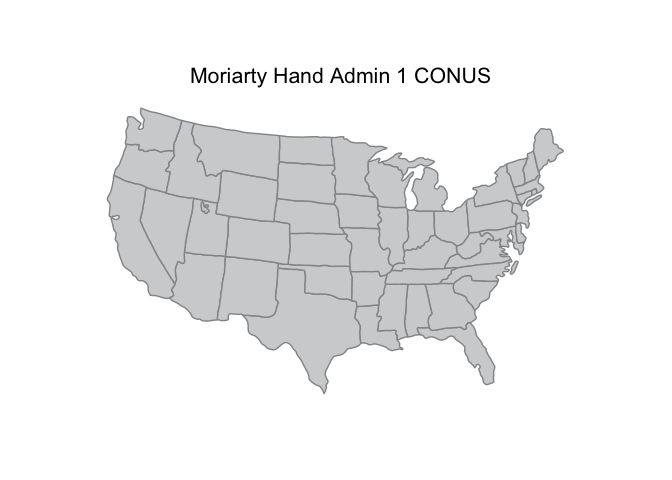
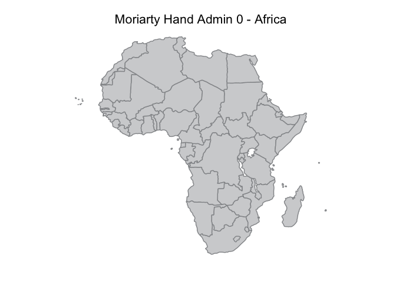
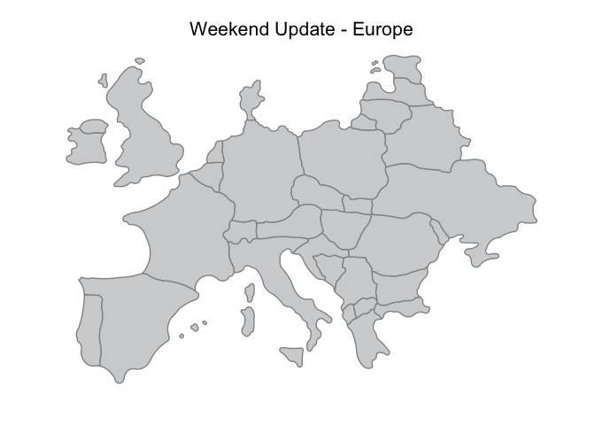

<!-- README.md is generated from README.Rmd. Please edit that file -->
lineworkmaps is compilation of [Project Linework](http://projectlinework.org/) maps in `SpatialPolygonsDataFrame` and `ggplot2` fortified objects ready for mapping, et al.

I took a minimalist approach to the package in that I don't have every linework (the calligraphy one seemed less than useful) and the functions only work for Admin 0 & Admin 1 polygons.

Please file an issue if there is functionality you'd like to see that isn't included. The package is at a very early stage so almost no suggestion will be turned away!

To get an idea of what you can do with these lineworks in R, head on over to [RPubs](http://rpubs.com/hrbrmstr/project-linework). It has been updated to use this package.

The Project Linework shapefiles also work well [with Leaflet](http://rpubs.com/hrbrmstr/linework-leaflet).

The following functions are implemented:

-   `lineworks` : Return vector of available linework shapes and optionally print verbose description of shapfile data elements.
-   `linework_map` : Retrieve a linework map as a regular or fortified `SpatialPolygonsDataFrame`

The following data sets are included:

-   `linework` : Project Linework spatial & fortified objects

### News

-   Version 0.0.1.9001 : naming consistency
-   Version 0.0.1.9000 : Added two new Project Linework map sets: Moriarty Hand and Weekend Update [[ref](http://www.projectlinework.org/2015/08/31/new_linework_sets.html)]
-   Version 0.0.0.9000 released

### Installation

``` r
devtools::install_github("hrbrmstr/lineworkmaps")
```

### Usage

``` r
library(lineworkmaps)
library(sp)
library(ggplot2)
library(ggthemes)

# current verison
packageVersion("lineworkmaps")
#> [1] '0.0.1.9000'

# plot admin1 polygons for Elmer Casual (the defaults)
plot(linework_map())
```


``` r

# plot the continental United States "Wargames" style
wargames <- linework_map("wargames", fortified=TRUE)

us <- wargames[wargames$iso_a2=="US" & 
               !wargames$code_hasc %in% c("US.HI", "US.AK"),]

ggplot(us) +
  geom_map(map=us, aes(x=long, y=lat, map_id=id)) +
  coord_map(project="albers", lat0=37.5, lat1=29.5) +
  theme_map()
```


``` r

# fancier example just focusing on the U.S.
elmer <- linework_map("elmer_casual", fortified=TRUE)

us <- elmer[elmer$COUNTRY=="US" & 
            elmer$Name != "Alaska",]

gg <- ggplot()
gg <- gg + geom_map(data=us, map=us,
                    aes(x=long, y=lat, map_id=id),
                    color="#939598", fill="#d1d2d4", size=0.5)
gg <- gg + coord_map(project="albers", lat0=37.5, lat1=29.5)
gg <- gg + labs(title="Elmer Casual")
gg <- gg + theme_map()
gg <- gg + theme(plot.title=element_text(size=16))
gg
```


``` r

# new maps: moriarty hand & weekend update

moriarty <- linework_map("moriarty_hand", fortified=TRUE)

us <- moriarty[substring(moriarty$ISO_3166_2, 1, 2) =="US" & 
               !(moriarty$ISO_3166_2 %in% c("US-AK", "US-HI")),]

gg <- ggplot()
gg <- gg + geom_map(data=us, map=us,
                    aes(x=long, y=lat, map_id=id),
                    color="#939598", fill="#d1d2d4", size=0.5)
gg <- gg + coord_map(project="albers", lat0=37.5, lat1=29.5)
gg <- gg + labs(title="Moriarty Hand Admin 1 CONUS")
gg <- gg + theme_map()
gg <- gg + theme(plot.title=element_text(size=16))
gg
```



``` r


moriarty <- linework_map("moriarty_hand", admin_level=0, fortified=FALSE)
moriarty <- subset(moriarty, region_un=="Africa")
moriarty <- fortify(moriarty)
#> Regions defined for each Polygons

gg <- ggplot()
gg <- gg + geom_map(data=moriarty, map=moriarty,
                    aes(x=long, y=lat, map_id=id),
                    color="#939598", fill="#d1d2d4", size=0.5)
gg <- gg + coord_quickmap()
gg <- gg + labs(title="Moriarty Hand Admin 0 - Africa")
gg <- gg + theme_map()
gg <- gg + theme(plot.title=element_text(size=16))
gg
```



``` r

weekend <- linework_map("weekend_update", admin_level=0, fortified=TRUE)
weekend <- subset(weekend, Country != "United States")

gg <- ggplot()
gg <- gg + geom_map(data=weekend, map=weekend,
                    aes(x=long, y=lat, map_id=id),
                    color="#939598", fill="#d1d2d4", size=0.5)
gg <- gg + coord_quickmap()
gg <- gg + labs(title="Weekend Update - Europe")
gg <- gg + theme_map()
gg <- gg + theme(plot.title=element_text(size=16))
gg
```



``` r

# info about the lineworks
lineworks(verbose=TRUE)
#> 
#> charmingly_inaccurate - admin0
#> 
#> 'data.frame':    1 obs. of  1 variable:
#>  $ RecNum: int 1
#> 
#> charmingly_inaccurate - admin1
#> 
#> 'data.frame':    49 obs. of  2 variables:
#>  $ Abbrev: chr  "ME" "NH" "VT" "MA" ...
#>  $ Name  : chr  "Maine" "New Hampshire" "Vermont" "Massachusetts" ...
#> 
#> elmer_casual - admin0
#> 
#> 'data.frame':    56 obs. of  8 variables:
#>  $ OBJECTID  : int  1 2 3 4 5 6 7 8 9 10 ...
#>  $ Name      : chr  "Canada" "Japan" "United States of America" "Montenegro" ...
#>  $ SOVEREIGN : chr  "Canada" "Japan" "United States of America" "Montenegro" ...
#>  $ ISO3166_A3: chr  "CAN" "JPN" "USA" "MNE" ...
#>  $ ISO3166_A2: chr  "CA" "JP" "US" "ME" ...
#>  $ FORMAL    : chr  "Canada" "Japan" "United States of America" "Montenegro" ...
#>  $ Shape_Leng: num  63096786 8471564 35803666 556561 785189 ...
#>  $ Shape_Area: num  1.51e+13 3.24e+11 9.87e+12 1.36e+10 2.82e+10 ...
#> 
#> elmer_casual - admin1
#> 
#> 'data.frame':    109 obs. of  6 variables:
#>  $ OBJECTID_1: int  1 2 3 4 5 6 7 13 14 15 ...
#>  $ Name      : chr  "Virginia" "Maryland" "New Brunswick" "Nova Scotia" ...
#>  $ ISO3166_2 : chr  "VA" "MD" "NB" "NS" ...
#>  $ COUNTRY   : chr  "US" "US" "CA" "CA" ...
#>  $ Shape_Leng: num  1938783 1301216 1307384 1954427 12562113 ...
#>  $ Shape_Area: num  9.22e+10 2.32e+10 7.52e+10 5.59e+10 2.70e+12 ...
#> 
#> geo_metro - admin0
#> 
#> 'data.frame':    24 obs. of  5 variables:
#>  $ ISO3166_A2: chr  "CA" "US" "CO" "EC" ...
#>  $ Name      : chr  "Canada" "United States of America" "Colombia" "Ecuador" ...
#>  $ FORMAL    : chr  "Canada" "United States of America" "Republic of Colombia" "Republic of Ecuador" ...
#>  $ SOVEREIGN : chr  "Canada" "United States of America" "Colombia" "Ecuador" ...
#>  $ ISO3166_A3: chr  "CAN" "USA" "COL" "ECU" ...
#> 
#> geo_metro - admin1
#> 
#> 'data.frame':    63 obs. of  3 variables:
#>  $ ISO3166_2: chr  "NU" "NT" "YT" "AK" ...
#>  $ NAME     : chr  "Nunavut" "Northwest Territories" "Yukon" "Alaska" ...
#>  $ COUNTRY  : chr  "CA" "CA" "CA" "US" ...
#> 
#> moriarty_hand - admin0
#> 
#> 'data.frame':    221 obs. of  24 variables:
#>  $ Name      : chr  "Canada" "United States of America" "Antarctica" "South Georgia and South Sandwich Islands" ...
#>  $ labelrank : num  2 2 4 4 2 2 5 5 6 2 ...
#>  $ sovereignt: chr  "Canada" "United States of America" "Antarctica" "United Kingdom" ...
#>  $ sov_a3    : chr  "CAN" "US1" "ATA" "GB1" ...
#>  $ adm0_dif  : num  0 1 0 1 0 0 1 1 1 1 ...
#>  $ type      : chr  "Sovereign country" "Country" "Indeterminate" "Dependency" ...
#>  $ adm0_a3   : chr  "CAN" "USA" "ATA" "SGS" ...
#>  $ name_long : chr  "Canada" "United States" "Antarctica" "South Georgia and South Sandwich Islands" ...
#>  $ abbrev    : chr  "Can." "U.S.A." "Ant." "S.G. S.S. Is." ...
#>  $ postal    : chr  "CA" "US" "AQ" "GS" ...
#>  $ formal_en : chr  "Canada" "United States of America" NA "South Georgia and South Sandwich Islands" ...
#>  $ formal_fr : chr  NA NA NA NA ...
#>  $ note_adm0 : chr  NA NA NA "U.K." ...
#>  $ name_alt  : chr  NA NA NA NA ...
#>  $ mapcolor7 : num  6 4 4 6 5 3 1 6 7 3 ...
#>  $ mapcolor8 : num  6 5 5 6 1 1 2 6 5 3 ...
#>  $ mapcolor9 : num  2 1 1 6 5 3 2 6 9 4 ...
#>  $ mapcolor13: num  2 1 -99 3 9 13 7 3 11 4 ...
#>  $ iso_a2    : chr  "CA" "US" "AQ" "GS" ...
#>  $ iso_a3    : chr  "CAN" "USA" "ATA" "SGS" ...
#>  $ iso_n3    : chr  "124" "840" "010" "239" ...
#>  $ continent : chr  "North America" "North America" "Antarctica" "Seven seas (open ocean)" ...
#>  $ region_un : chr  "Americas" "Americas" "Antarctica" "Seven seas (open ocean)" ...
#>  $ subregion : chr  "Northern America" "Northern America" "Antarctica" "Seven seas (open ocean)" ...
#> 
#> moriarty_hand - admin1
#> 
#> 'data.frame':    64 obs. of  6 variables:
#>  $ Name      : chr  "Hawaii" "Florida" "Louisiana" "Georgia" ...
#>  $ Name_Alt  : chr  "HI|Hawaii" "FL|Fla." "LA" "GA|Ga." ...
#>  $ Admin     : chr  "United States of America" "United States of America" "United States of America" "United States of America" ...
#>  $ Abbrev    : chr  "Hawaii" "Fla." "La." "Ga." ...
#>  $ Postal    : chr  "HI" "FL" "LA" "GA" ...
#>  $ ISO_3166_2: chr  "US-HI" "US-FL" "US-LA" "US-GA" ...
#> 
#> times_approximate - admin0
#> 
#> 'data.frame':    3 obs. of  5 variables:
#>  $ NAME      : chr  "Canada" "Mexico" "United States of America"
#>  $ Formal    : chr  "Canada" "United Mexican States" "United States of America"
#>  $ Sovereign : chr  "Canada" "Mexico" "United States of America"
#>  $ ISO3166_A3: chr  "CAN" "MEX" "USA"
#>  $ ISO3166_A2: chr  "CA" "MX" "US"
#> 
#> times_approximate - admin1
#> 
#> 'data.frame':    49 obs. of  3 variables:
#>  $ NAME     : chr  "Idaho" "New Jersey" "Massachusetts" "Rhode Island" ...
#>  $ ISO3166_2: chr  "ID" "NJ" "MA" "RI" ...
#>  $ Country  : chr  "US" "US" "US" "US" ...
#> 
#> twenty_seventy - admin0
#> 
#> 'data.frame':    3 obs. of  7 variables:
#>  $ NAME      : chr  "Canada" "United States of America" "Mexico"
#>  $ ISO3166_A3: chr  "CAN" "USA" "MEX"
#>  $ ISO3166_A2: chr  "CA" "US" "MX"
#>  $ FORMAL    : chr  "Canada" "United States of America" "United Mexican States"
#>  $ SOVEREIGN : chr  "Canada" "United States of America" "Mexico"
#>  $ Shape_Leng: num  55760364 33141463 9752447
#>  $ Shape_Area: num  1.54e+13 1.01e+13 1.40e+12
#> 
#> twenty_seventy - admin1
#> 
#> 'data.frame':    62 obs. of  8 variables:
#>  $ OBJECTID_1: int  1 2 3 4 5 6 7 8 9 10 ...
#>  $ OBJECTID  : int  1 2 3 4 5 6 7 8 9 10 ...
#>  $ Name      : chr  "Nunavut" "Utah" "North Dakota" "Wyoming" ...
#>  $ Country   : chr  "CA" "US" "US" "US" ...
#>  $ ISO3166_2 : chr  "NU" "UT" "ND" "WY" ...
#>  $ Shape_Leng: num  25574960 1857766 1797346 1965964 1859481 ...
#>  $ Shape_Le_1: num  25574960 1857766 1797346 1965964 1859481 ...
#>  $ Shape_Area: num  3.79e+12 1.94e+11 1.95e+11 2.38e+11 1.88e+11 ...
#> 
#> wargames - admin0
#> 
#> 'data.frame':    229 obs. of  22 variables:
#>  $ OBJECTID  : int  1 2 3 4 5 6 7 8 9 10 ...
#>  $ Name      : chr  "Afghanistan" "Albania" "Algeria" "Andorra" ...
#>  $ SOVEREIGNT: chr  "Afghanistan" "Albania" "Algeria" "Andorra" ...
#>  $ SOV_A3    : chr  "AFG" "ALB" "DZA" "AND" ...
#>  $ ADM0_DIF  : num  0 0 0 0 0 0 0 0 0 1 ...
#>  $ TYPE      : chr  "Sovereign country" "Sovereign country" "Sovereign country" "Sovereign country" ...
#>  $ ADMIN     : chr  "Afghanistan" "Albania" "Algeria" "Andorra" ...
#>  $ ADM0_A3   : chr  "AFG" "ALB" "DZA" "AND" ...
#>  $ GEOU_DIF  : num  0 0 0 0 0 0 0 0 0 0 ...
#>  $ GEOUNIT   : chr  "Afghanistan" "Albania" "Algeria" "Andorra" ...
#>  $ GU_A3     : chr  "AFG" "ALB" "DZA" "AND" ...
#>  $ SU_DIF    : num  0 0 0 0 0 0 0 0 0 0 ...
#>  $ SUBUNIT   : chr  "Afghanistan" "Albania" "Algeria" "Andorra" ...
#>  $ SU_A3     : chr  "AFG" "ALB" "DZA" "AND" ...
#>  $ NAME_1    : chr  "Afghanistan" "Albania" "Algeria" "Andorra" ...
#>  $ ABBREV    : chr  "Afg." "Alb." "Alg." "And." ...
#>  $ POSTAL    : chr  "AF" "AL" "DZ" "AND" ...
#>  $ NAME_FORMA: chr  "Islamic State of Afghanistan" "Republic of Albania" "People's Democratic Republic of Algeria" "Principality of Andorra" ...
#>  $ TERR_     : chr  "" "" "" "" ...
#>  $ ISO_A2    : chr  "AF" "AL" "DZ" "AD" ...
#>  $ ISO_A3    : chr  "AFG" "ALB" "DZA" "AND" ...
#>  $ ISO_N3    : num  4 8 12 20 24 10 28 32 51 36 ...
#> 
#> wargames - admin1
#> 
#> 'data.frame':    400 obs. of  16 variables:
#>  $ OBJECTID  : int  1 2 3 4 5 6 7 8 9 10 ...
#>  $ adm1_code : chr  "RUS-2324" "MEX-2725" "MEX-2729" "MEX-2724" ...
#>  $ iso_3166_2: chr  "RU-" "MX-" "MX-" "MX-" ...
#>  $ sr_sov_a3 : chr  "RUS" "MEX" "MEX" "MEX" ...
#>  $ sr_adm0_a3: chr  "RUS" "MEX" "MEX" "MEX" ...
#>  $ iso_a2    : chr  "RU" "MX" "MX" "MX" ...
#>  $ name      : chr  "Kaliningrad" "Tabasco" "Guerrero" "Puebla" ...
#>  $ name_alt  : chr  "Kaliningradskaya Oblast" "" "" "" ...
#>  $ name_local: chr  "??????????????? ???????" "" "" "" ...
#>  $ type      : chr  "Oblast" "Estado" "Estado" "Estado" ...
#>  $ type_en   : chr  "Region" "State" "State" "State" ...
#>  $ code_hasc : chr  "RU.KN" "MX.TB" "MX.GR" "MX.PU" ...
#>  $ provnum_ne: int  7 20018 20016 20023 20004 20017 0 20007 20034 0 ...
#>  $ abbrev    : chr  "" "" "" "" ...
#>  $ postal    : chr  "KN" "TB" "GR" "PU" ...
#>  $ admin     : chr  "Russia" "Mexico" "Mexico" "Mexico" ...
#> 
#> weekend_update - admin0
#> 
#> 'data.frame':    80 obs. of  3 variables:
#>  $ Color  : int  1 2 3 2 1 4 1 2 3 3 ...
#>  $ Country: chr  "United States" "United States" "United States" "United States" ...
#>  $ State  : chr  "Washington" "Oregon" "Idaho" "Montana" ...
#> [1] "charmingly_inaccurate" "elmer_casual"          "geo_metro"             "moriarty_hand"        
#> [5] "times_approximate"     "twenty_seventy"        "wargames"              "weekend_update"
```

### Test Results

``` r
library(lineworkmaps)
library(testthat)

date()
#> [1] "Mon Aug 31 21:16:02 2015"

test_dir("tests/")
#> testthat results ========================================================================================================
#> OK: 0 SKIPPED: 0 FAILED: 0
#> 
#> DONE
```

### Code of Conduct

Please note that this project is released with a [Contributor Code of Conduct](CONDUCT.md). By participating in this project you agree to abide by its terms.
