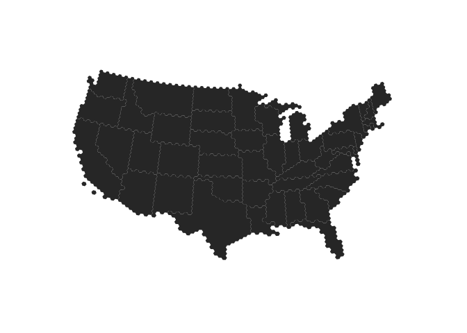

<!-- README.md is generated from README.Rmd. Please edit that file -->
lineworkmaps is compilation of [Project Linework](http://projectlinework.org/) maps in `SpatialPolygonsDataFrame` and `ggplot2` fortified objects ready for mapping, et al.

I took a minimalist approach to the package in that I don't have every linework (the calligraphy one seemed less than useful) and the functions only work for Admin 0 & Admin 1 polygons.

Please file an issue if there is functionality you'd like to see that isn't included. The package is at a very early stage so almost no suggestion will be turned away!

To get an idea of what you can do with these lineworks in R, head on over to [RPubs](http://rpubs.com/hrbrmstr/project-linework). It has been updated to use this package.

The following functions are implemented:

-   `lineworks` : Return vector of available linework shapes and optionally print verbose description of shapfile data elements.
-   `linework_map` : Retrieve a linework map as a regular or fortified `SpatialPolygonsDataFrame`

The following data sets are included:

-   `linework` : Project Linework spatial & fortified objects

### News

-   Version 0.0.0.9000 released

### Installation

``` r
devtools::install_github("hrbrmstr/lineworkmaps")
```

### Usage

``` r
library(lineworkmaps)
library(sp)
library(ggplot2)
library(ggthemes)

# current verison
packageVersion("lineworkmaps")
#> [1] '0.0.0.9000'

# plot admin1 polygons for Elmer Casual (the defaults)
plot(linework_map())
```


``` r

# plot the continental United States "Wargames" style
wargames <- linework_map("wargames", fortified=TRUE)

us <- wargames[wargames$iso_a2=="US" & 
               !wargames$code_hasc %in% c("US.HI", "US.AK"),]

ggplot(us) +
  geom_map(map=us, aes(x=long, y=lat, map_id=id)) +
  coord_map(project="albers", lat0=37.5, lat1=29.5) +
  theme_map()
```



``` r

# fancier example just focusing on the U.S.
elmer <- linework_map("elmer_casual", fortified=TRUE)

us <- elmer[elmer$COUNTRY=="US" & 
            elmer$Name != "Alaska",]

gg <- ggplot()
gg <- gg + geom_map(data=us, map=us,
                    aes(x=long, y=lat, map_id=id),
                    color="#939598", fill="#d1d2d4", size=0.5)
gg <- gg + coord_map(project="albers", lat0=37.5, lat1=29.5)
gg <- gg + labs(title="Elmer Casual")
gg <- gg + theme_map()
gg <- gg + theme(plot.title=element_text(size=16))
gg
```


``` r

# info about the lineworks
lineworks(verbose=TRUE)
#> 
#> charmingly_inaccurate - admin0
#> 
#> 'data.frame':    1 obs. of  1 variable:
#>  $ RecNum: int 1
#> 
#> charmingly_inaccurate - admin1
#> 
#> 'data.frame':    49 obs. of  2 variables:
#>  $ Abbrev: Factor w/ 49 levels "AL","AR","AZ",..: 20 29 45 18 38 6 33 30 37 7 ...
#>  $ Name  : Factor w/ 49 levels "Alabama","Arizona",..: 18 28 44 20 38 6 31 29 37 8 ...
#> 
#> elmer_casual - admin0
#> 
#> 'data.frame':    56 obs. of  8 variables:
#>  $ OBJECTID  : int  1 2 3 4 5 6 7 8 9 10 ...
#>  $ Name      : Factor w/ 56 levels "Albania","Austria",..: 8 28 56 36 1 18 13 25 55 40 ...
#>  $ SOVEREIGN : Factor w/ 55 levels "Albania","Austria",..: 8 28 55 36 1 18 13 25 54 40 ...
#>  $ ISO3166_A3: Factor w/ 56 levels "---","ALB","AUT",..: 10 33 56 40 2 15 16 29 22 44 ...
#>  $ ISO3166_A2: Factor w/ 56 levels "AL","AT","BA",..: 9 32 55 37 1 14 15 28 21 43 ...
#>  $ FORMAL    : Factor w/ 56 levels "Belize","Bosnia and Herzegovina",..: 4 16 56 23 25 9 18 13 54 44 ...
#>  $ Shape_Leng: num  63096786 8471564 35803666 556561 785189 ...
#>  $ Shape_Area: num  1.51e+13 3.24e+11 9.87e+12 1.36e+10 2.82e+10 ...
#> 
#> elmer_casual - admin1
#> 
#> 'data.frame':    109 obs. of  6 variables:
#>  $ OBJECTID_1: int  1 2 3 4 5 6 7 13 14 15 ...
#>  $ Name      : Factor w/ 108 levels "Aichi","Akita",..: 99 44 59 69 68 70 4 108 9 43 ...
#>  $ ISO3166_2 : Factor w/ 106 levels "01","02","03",..: 100 67 73 81 82 83 47 106 51 66 ...
#>  $ COUNTRY   : Factor w/ 3 levels "CA","JP","US": 3 3 1 1 1 1 3 1 1 1 ...
#>  $ Shape_Leng: num  1938783 1301216 1307384 1954427 12562113 ...
#>  $ Shape_Area: num  9.22e+10 2.32e+10 7.52e+10 5.59e+10 2.70e+12 ...
#> 
#> geo_metro - admin0
#> 
#> 'data.frame':    24 obs. of  5 variables:
#>  $ ISO3166_A2: Factor w/ 24 levels "BR","BS","BZ",..: 4 23 5 9 19 1 24 14 10 16 ...
#>  $ Name      : Factor w/ 24 levels "Belize","Brazil",..: 3 23 4 8 19 2 24 14 10 16 ...
#>  $ FORMAL    : Factor w/ 24 levels "Belize","Bolivarian Republic of Venezuela",..: 3 24 10 13 21 7 2 18 8 23 ...
#>  $ SOVEREIGN : Factor w/ 23 levels "Belize","Brazil",..: 3 22 4 9 19 2 23 14 7 16 ...
#>  $ ISO3166_A3: Factor w/ 24 levels "BHS","BLZ","BRA",..: 4 23 5 9 19 3 24 14 10 16 ...
#> 
#> geo_metro - admin1
#> 
#> 'data.frame':    63 obs. of  3 variables:
#>  $ ISO3166_2: Factor w/ 63 levels "AB","AK","AL",..: 40 39 63 2 6 1 53 22 45 49 ...
#>  $ NAME     : Factor w/ 63 levels "Alabama","Alaska",..: 42 40 63 2 6 3 51 22 45 49 ...
#>  $ COUNTRY  : Factor w/ 2 levels "CA","US": 1 1 1 2 1 1 1 1 1 1 ...
#> 
#> times_approximate - admin0
#> 
#> 'data.frame':    3 obs. of  5 variables:
#>  $ NAME      : Factor w/ 3 levels "Canada","Mexico",..: 1 2 3
#>  $ Formal    : Factor w/ 3 levels "Canada","United Mexican States",..: 1 2 3
#>  $ Sovereign : Factor w/ 3 levels "Canada","Mexico",..: 1 2 3
#>  $ ISO3166_A3: Factor w/ 3 levels "CAN","MEX","USA": 1 2 3
#>  $ ISO3166_A2: Factor w/ 3 levels "CA","MX","US": 1 2 3
#> 
#> times_approximate - admin1
#> 
#> 'data.frame':    49 obs. of  3 variables:
#>  $ NAME     : Factor w/ 49 levels "Alabama","Arizona",..: 11 29 20 38 5 15 39 41 19 45 ...
#>  $ ISO3166_2: Factor w/ 49 levels "AL","AR","AZ",..: 12 30 18 38 5 15 39 41 19 44 ...
#>  $ Country  : Factor w/ 1 level "US": 1 1 1 1 1 1 1 1 1 1 ...
#> 
#> twenty_seventy - admin0
#> 
#> 'data.frame':    3 obs. of  7 variables:
#>  $ NAME      : Factor w/ 3 levels "Canada","Mexico",..: 1 3 2
#>  $ ISO3166_A3: Factor w/ 3 levels "CAN","MEX","USA": 1 3 2
#>  $ ISO3166_A2: Factor w/ 3 levels "CA","MX","US": 1 3 2
#>  $ FORMAL    : Factor w/ 3 levels "Canada","United Mexican States",..: 1 3 2
#>  $ SOVEREIGN : Factor w/ 3 levels "Canada","Mexico",..: 1 3 2
#>  $ Shape_Leng: num  55760364 33141463 9752447
#>  $ Shape_Area: num  1.54e+13 1.01e+13 1.40e+12
#> 
#> twenty_seventy - admin1
#> 
#> 'data.frame':    62 obs. of  8 variables:
#>  $ OBJECTID_1: int  1 2 3 4 5 6 7 8 9 10 ...
#>  $ OBJECTID  : int  1 2 3 4 5 6 7 8 9 10 ...
#>  $ Name      : Factor w/ 62 levels "Alabama","Alaska",..: 42 56 39 62 53 44 55 28 30 17 ...
#>  $ Country   : Factor w/ 2 levels "CA","US": 1 2 2 2 2 2 2 2 2 2 ...
#>  $ ISO3166_2 : Factor w/ 62 levels "AB","AK","AL",..: 40 56 32 62 52 44 55 27 33 14 ...
#>  $ Shape_Leng: num  25574960 1857766 1797346 1965964 1859481 ...
#>  $ Shape_Le_1: num  25574960 1857766 1797346 1965964 1859481 ...
#>  $ Shape_Area: num  3.79e+12 1.94e+11 1.95e+11 2.38e+11 1.88e+11 ...
#> 
#> wargames - admin0
#> 
#> 'data.frame':    229 obs. of  22 variables:
#>  $ OBJECTID  : int  1 2 3 4 5 6 7 8 9 10 ...
#>  $ Name      : Factor w/ 229 levels "Afghanistan",..: 1 3 4 6 7 9 10 11 12 14 ...
#>  $ SOVEREIGNT: Factor w/ 200 levels "Afghanistan",..: 1 2 3 4 5 6 7 8 9 10 ...
#>  $ SOV_A3    : Factor w/ 200 levels "AFG","AGO","ALB",..: 1 3 52 4 2 8 9 6 7 10 ...
#>  $ ADM0_DIF  : num  0 0 0 0 0 0 0 0 0 1 ...
#>  $ TYPE      : Factor w/ 6 levels "Country","County",..: 6 6 6 6 6 5 6 6 6 3 ...
#>  $ ADMIN     : Factor w/ 229 levels "Afghanistan",..: 1 3 4 6 7 9 10 11 12 14 ...
#>  $ ADM0_A3   : Factor w/ 229 levels "ABW","AFG","AGO",..: 2 5 61 7 3 12 15 9 10 13 ...
#>  $ GEOU_DIF  : num  0 0 0 0 0 0 0 0 0 0 ...
#>  $ GEOUNIT   : Factor w/ 229 levels "Afghanistan",..: 1 3 4 6 7 9 10 11 12 14 ...
#>  $ GU_A3     : Factor w/ 229 levels "ABW","AFG","AGO",..: 2 5 61 7 3 12 15 9 10 13 ...
#>  $ SU_DIF    : num  0 0 0 0 0 0 0 0 0 0 ...
#>  $ SUBUNIT   : Factor w/ 229 levels "Afghanistan",..: 1 3 4 6 7 9 10 11 12 14 ...
#>  $ SU_A3     : Factor w/ 229 levels "ABW","AFG","AGO",..: 2 5 61 7 3 12 15 9 10 13 ...
#>  $ NAME_1    : Factor w/ 229 levels "Afghanistan",..: 1 3 4 6 7 9 10 11 12 14 ...
#>  $ ABBREV    : Factor w/ 227 levels "A.C.Is.","Afg.",..: 2 4 5 7 8 9 10 11 12 1 ...
#>  $ POSTAL    : Factor w/ 222 levels "A","AE","AF",..: 3 6 56 7 8 9 4 10 11 13 ...
#>  $ NAME_FORMA: Factor w/ 188 levels "","\xc5land Islands",..: 40 68 61 65 69 1 1 4 70 173 ...
#>  $ TERR_     : Factor w/ 12 levels "","Assoc. with N.Z.",..: 1 1 1 1 1 9 1 1 1 1 ...
#>  $ ISO_A2    : Factor w/ 224 levels "-99","AD","AE",..: 4 7 57 2 9 10 5 11 8 14 ...
#>  $ ISO_A3    : Factor w/ 225 levels "-99","ABW","AFG",..: 3 7 61 8 4 13 15 10 11 16 ...
#>  $ ISO_N3    : num  4 8 12 20 24 10 28 32 51 36 ...
#> 
#> wargames - admin1
#> 
#> 'data.frame':    400 obs. of  16 variables:
#>  $ OBJECTID  : int  1 2 3 4 5 6 7 8 9 10 ...
#>  $ adm1_code : Factor w/ 400 levels "AUS-1932","AUS-2650",..: 261 230 234 229 242 224 345 221 214 363 ...
#>  $ iso_3166_2: Factor w/ 110 levels "AU-","BR-","CA-AB",..: 58 57 57 57 57 57 70 57 57 77 ...
#>  $ sr_sov_a3 : Factor w/ 16 levels "AU1","BRA","CAN",..: 14 12 12 12 12 12 15 12 12 15 ...
#>  $ sr_adm0_a3: Factor w/ 18 levels "AUS","BRA","CAN",..: 16 14 14 14 14 14 17 14 14 17 ...
#>  $ iso_a2    : Factor w/ 18 levels "AU","BR","CA",..: 16 15 15 15 15 15 17 15 15 17 ...
#>  $ name      : Factor w/ 399 levels "\xc9quateur",..: 153 342 119 291 395 145 126 343 72 193 ...
#>  $ name_alt  : Factor w/ 281 levels "","\xcele de Saint-Jean|\xcele du Prince-\xc9douard",..: 118 1 1 1 1 1 104 1 1 140 ...
#>  $ name_local: Factor w/ 46 levels "","??","????-????????? ????????? ???",..: 38 1 1 1 1 1 1 1 1 1 ...
#>  $ type      : Factor w/ 27 levels "","Arrondissement",..: 15 8 8 8 8 8 22 8 8 22 ...
#>  $ type_en   : Factor w/ 16 levels "","Arrondissement",..: 12 14 14 14 14 14 14 14 14 14 ...
#>  $ code_hasc : Factor w/ 343 levels "","AU.CT","AU.JB",..: 230 193 178 187 197 180 295 195 171 302 ...
#>  $ provnum_ne: int  7 20018 20016 20023 20004 20017 0 20007 20034 0 ...
#>  $ abbrev    : Factor w/ 96 levels "","A.C.T.","Acre",..: 1 1 1 1 1 1 24 1 1 32 ...
#>  $ postal    : Factor w/ 248 levels "","AB","AD","AG",..: 102 206 61 171 245 84 72 210 30 111 ...
#>  $ admin     : Factor w/ 18 levels "Australia","Brazil",..: 15 14 14 14 14 14 18 14 14 18 ...
#> [1] "charmingly_inaccurate" "elmer_casual"          "geo_metro"             "times_approximate"    
#> [5] "twenty_seventy"        "wargames"
```

### Test Results

``` r
library(lineworkmaps)
library(testthat)

date()
#> [1] "Tue Jul 21 12:40:47 2015"

test_dir("tests/")
#> testthat results ========================================================================================================
#> OK: 0 SKIPPED: 0 FAILED: 0
#> 
#> DONE
```

### Code of Conduct

Please note that this project is released with a [Contributor Code of Conduct](CONDUCT.md). By participating in this project you agree to abide by its terms.
